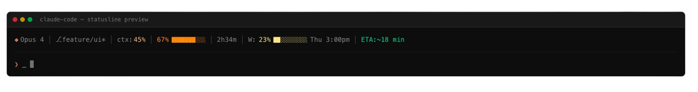

# Clauder - Claude Code Rate Limit Monitor

[](https://marketplace.visualstudio.com/items?itemName=nrentas.clauder)
[](https://marketplace.visualstudio.com/items?itemName=nrentas.clauder)
[](https://open-vsx.org/extension/nrentas/clauder)
[](https://codecov.io/gh/nksrentas/clauder)

> Real-time rate limit monitoring for Claude Code with a beautiful customizable statusline

**[clauder.fyi](https://clauder.fyi)** | Configure your experience from the web dashboard


---

## Features

### Smart Statusline

Real-time monitoring directly in your terminal:

- **5-hour rate limit** tracking with progress bar
- **Weekly usage** monitoring with reset countdown
- **Context window** usage percentage
- **Git branch** with dirty indicator
- **ML-powered ETA predictions** (Pro)


### Full Customization

Configure everything from [clauder.fyi/dashboard/extension](https://clauder.fyi/dashboard/extension):

- **Drag & Drop Reordering** - Arrange elements in any order
- **Custom Icons** - Choose from 6+ icon styles per element
- **Unicode/ASCII Mode** - Works in any terminal
- **Progress Bars** - Visual usage indicators

### Sound Notifications

- Prompt completion alerts
- Rate limit warnings
- Customizable thresholds (50-99%)

### Budget Tracking (Pro)

- Daily, weekly, monthly limits
- Real-time cost monitoring
- Auto-block when exceeded

---

## Quick Install

```bash
curl -fsSL https://clauder.fyi/api/scripts/install | bash
```

Or generate a personalized install script at [clauder.fyi](https://clauder.fyi).

---

## Statusline Elements

| Element | Description | Icons |
|---------|-------------|-------|
| **Model** | Active Claude model | `◆` `★` `⚡` `🤖` `🧠` `✦` |
| **Git Branch** | Current branch + dirty | *(none)* `$` `⎇` |
| **Context** | Window usage % | `ctx:` `◫` `mem:` |
| **5-Hour** | Rate limit + bar | `%` `⏱` `▣` |
| **Time Left** | Until reset | *(clock)* `⏳` `→` |
| **Weekly** | 7-day usage | `W:` `📅` `7d:` |
| **Prediction** | ETA to limit | `~` `ETA:` `≈` |

---

## VS Code Extension

A VS Code extension that displays your Claude Code usage in the status bar. Monitor your 5-hour session and weekly limits at a glance.


### Status Bar Features

- Shows your current 5-hour session usage with time until reset
- Color-coded indicator that shifts from tan to red as usage increases
- Automatically shows weekly usage when approaching your weekly limit
- Alerts when you hit the 5-hour or weekly limit

### Installation

Install from the [VS Code Marketplace](https://marketplace.visualstudio.com/items?itemName=nrentas.clauder) or search for "Clauder" in VS Code Extensions.

### Requirements

- macOS (uses Keychain for OAuth credentials)
- Claude Code CLI installed and authenticated (`claude` command)

### Configuration

**General**

| Setting | Default | Description |
|---------|---------|-------------|
| `clauder.refreshInterval` | `30` | Auto-refresh interval in seconds (5-300) |
| `clauder.weeklyHighlightThreshold` | `90` | Show weekly usage when above this % (50-100) |
| `clauder.statusDisplay` | `both` | Where to display status: `both`, `vscode`, or `shell` |
| `clauder.showProgress` | `true` | Show usage progress in the status bar |

**Sound Notifications**

| Setting | Default | Description |
|---------|---------|-------------|
| `clauder.sounds.enabled` | `true` | Enable all sound notifications |
| `clauder.sounds.promptCompletion` | `true` | Play sound when Claude finishes responding |
| `clauder.sounds.rateLimitWarning` | `true` | Play sound when approaching rate limits |
| `clauder.sounds.rateLimitHit` | `true` | Play sound when rate limit is reached |
| `clauder.sounds.warningThreshold` | `80` | Usage % to trigger warning sound (50-99) |
| `clauder.sounds.customSoundPath` | `""` | Optional path to custom sound file |

**Sync (Pro)**

| Setting | Default | Description |
|---------|---------|-------------|
| `clauder.sync.enabled` | `false` | Enable syncing to Clauder backend for predictions |
| `clauder.sync.licenseKey` | `""` | License key for Clauder Pro |
| `clauder.sync.backendUrl` | `https://clauder.app` | Backend URL for sync |
| `clauder.sync.interval` | `30` | Sync interval in seconds (15-120) |

### Commands

- **Clauder: Refresh** - Manually refresh usage data
- **Clauder: Toggle Sound Notifications** - Enable/disable sounds
- **Clauder: Toggle Progress Display** - Show/hide shell statusline progress
- **Clauder: Install Shell Integration** - Install statusline scripts

---

## Environment Variables

| Variable | Description |
|----------|-------------|
| `CLAUDER_ASCII` | Set to `1` to force ASCII mode |
| `CLAUDER_API_KEY` | Your API key for Pro features |

---

## Pro Features

Unlock with [clauder.fyi](https://clauder.fyi):

- Statusline configurator with live preview
- Sound notifications
- ML-powered predictions
- Budget tracking & alerts
- Webhook integrations

---

## Links

- **Website**: [clauder.fyi](https://clauder.fyi)
- **Dashboard**: [clauder.fyi/dashboard](https://clauder.fyi/dashboard)
- **Extension Config**: [clauder.fyi/dashboard/extension](https://clauder.fyi/dashboard/extension)
- **Report Issues**: [clauder.fyi/report-issue](https://clauder.fyi/report-issue)

---

## Troubleshooting

**"Not authenticated" message**

Run `claude` in your terminal and complete the authentication flow. The extension reads credentials from the same Keychain entry used by Claude Code CLI.

**Usage data not updating**

Click the status bar item or run "Clauder: Refresh" from the Command Palette.

---

## License

MIT
