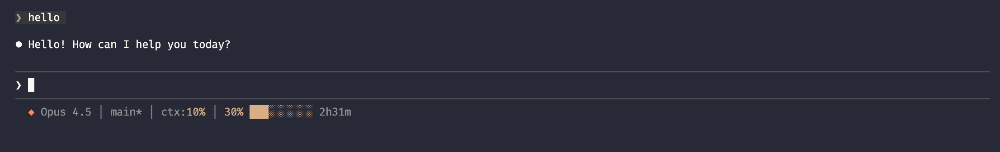

# Clauder

[](https://marketplace.visualstudio.com/items?itemName=nrentas.clauder)
[](https://marketplace.visualstudio.com/items?itemName=nrentas.clauder)
[](https://open-vsx.org/extension/nrentas/clauder)
[](https://codecov.io/gh/nksrentas/clauder)

Tools for monitoring your Claude Code usage: shell scripts for Claude Code's built-in statusline and a VS Code extension for status bar integration.

## Statusline Scripts

Enhance Claude Code's native statusline with rate limit tracking, git status, and more.



### Features

- Model name with Claude diamond icon
- Git branch with dirty indicator
- Context window usage percentage
- 5-hour rate limit with progress bar and countdown
- Weekly rate limit with progress bar and reset day/time

### Installation

```bash
curl -fsSL https://hellobussin.com/clauder/install.sh | bash
```

### Configuration

Add to `~/.claude/settings.json`:

```json
{
  "statusLine": {
    "type": "command",
    "command": "~/.claude/scripts/statusline-command.sh",
    "padding": 0
  }
}
```

### Output Format

```
◆ Opus 4.5 │ main* │ ctx:10% │ 30% ████████░░ 2h31m │ W:15% ████░░░░░░ Sat 2pm
```

| Element | Description |
|---------|-------------|
| `◆ Opus 4.5` | Current model with Claude diamond icon |
| `main*` | Git branch (`*` indicates uncommitted changes) |
| `ctx:10%` | Context window usage |
| `30% ████████░░ 2h31m` | 5-hour rate limit: percentage, progress bar, time until reset |
| `W:15% ████░░░░░░ Sat 2pm` | Weekly rate limit: percentage, progress bar, reset day/time |

## VS Code Extension

A VS Code extension that displays your Claude Code usage in the status bar. Monitor your 5-hour session and weekly limits at a glance.


### Features

**Status Bar Display**
- Shows your current 5-hour session usage with time until reset
- Color-coded indicator that shifts from tan to red as usage increases
- Automatically shows weekly usage when approaching your weekly limit

**Limit Detection**
- Alerts you when you hit the 5-hour or weekly limit
- Automatically pauses polling and resumes when your limit resets

**Detailed Tooltip**
- Weekly usage for all models with reset day/time
- Weekly Sonnet-only usage (if applicable)
- Model breakdown with token counts and estimated costs

### Requirements

- macOS (uses Keychain for OAuth credentials)
- Claude Code CLI installed and authenticated (`claude` command)

### Installation

Install from the [VS Code Marketplace](https://marketplace.visualstudio.com/items?itemName=nrentas.clauder) or search for "Clauder" in VS Code Extensions.

### How It Works

The extension reads your OAuth token from macOS Keychain (stored by Claude Code CLI) and fetches usage data from Anthropic's API.

**Status bar examples:**

```
61% | 2h 15m              Normal usage
61% | 2h 15m · W 92% | Sun 22   Weekly usage highlighted (>90%)
5h limit reached | 45m    Limit hit, shows time until reset
```

**Hover for details:**

Hover over the status bar item to see a breakdown of your weekly usage across all models, Sonnet-specific limits, and estimated costs.

### Configuration

| Setting                            | Default | Description                                              |
| ---------------------------------- | ------- | -------------------------------------------------------- |
| `clauder.plan`                     | `pro`   | Your subscription plan: `pro`, `max5`, or `max20`        |
| `clauder.refreshInterval`          | `30`    | Auto-refresh interval in seconds (5-300)                 |
| `clauder.weeklyHighlightThreshold` | `90`    | Show weekly usage in status bar when above this % (50-100) |

### Commands

- **Clauder: Refresh** - Manually refresh usage data (or click the status bar)

### Troubleshooting

**"Not authenticated" message**

Run `claude` in your terminal and complete the authentication flow. The extension reads credentials from the same Keychain entry used by Claude Code CLI.

**Usage data not updating**

Click the status bar item or run "Clauder: Refresh" from the Command Palette.

## License

MIT
