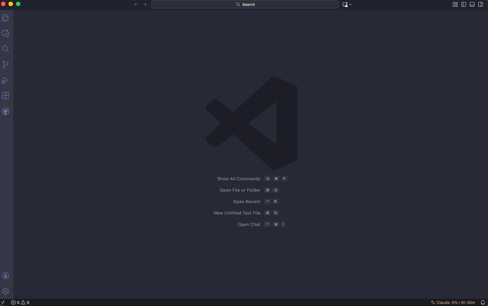

# Clauder



VS Code extension that displays your Claude Code usage in the status bar.

## Features

- Real-time usage data from Anthropic's OAuth API
- Status bar shows current session usage percentage and time until reset
- Hover tooltip with detailed breakdown:
  - Current session usage
  - Weekly usage (all models)
  - Weekly usage (Sonnet only)
  - Model breakdown with cost estimates

## Requirements

- macOS (uses Keychain for OAuth credentials)
- Claude Code CLI installed and authenticated

## Installation

Install from the VS Code Marketplace or search for "Clauder" in the Extensions view.

## Usage

The extension activates automatically. Look for the sparkle icon in the status bar:

```
$(sparkle) Claude: 61% | 2h 15m
```

- Click the status bar item to refresh
- Run "Clauder: Refresh" from Command Palette

## Configuration

| Setting                   | Default | Description                               |
| ------------------------- | ------- | ----------------------------------------- |
| `clauder.plan`            | `pro`   | Your subscription plan (pro, max5, max20) |
| `clauder.refreshInterval` | `30`    | Auto-refresh interval in seconds          |

## License

MIT
